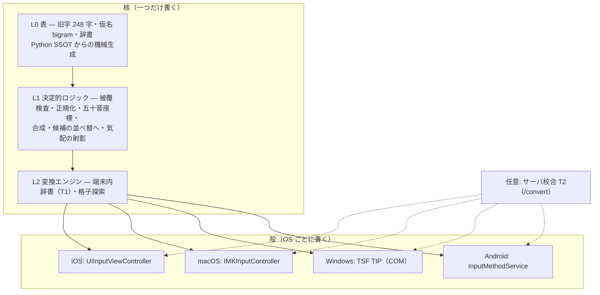

# 多platform展開 — macOS・Windows へ広げ、iOS だけ native に残す

> **問ひ**: 「今の時代クロスプラットフォーム開発はできるか。iOS ネイティブさへ残せたら、
> ほかは標準化したい」——本書はこれに答へる設計である。
>
> **答**: **殻（かく）は標準化できない。核（かく）は完全に標準化できる。**
> そして矢立の価値はほぼ全部が核の側にある。だから「iOS だけ native」ではなく
> **「全 OS の殻が native、核は一つ」** が正解になる。字面は違ふが、望んだ結果は満たす。

> **実装状況（2026-07-31）**: **M5-a が入つた**。`core/`（Rust）に旧字変換・五十音の地図・
> 作業帯・**墨の氣配**・**原器（縦組五十音配列）**が揃ひ、黄金ベクトル 4 種
> （`kyuji` / `gojuon` / `kehai` / `genki`）を
> `cargo test` が流してゐる。仮名 bigram は Swift と Rust が**同じ一つのデータ**
> （`core/data/kana_bigram.txt`）から起こされるやうになつた。
> CI は ubuntu（課金 1 倍）で、生成物の鮮度ゲートつき（§6・§7・§10）。
> **M7 の骨組みも入つた** — `windows/`（TSF 殻）が生まれ、OS を知らない頭脳
> （`session`）は ubuntu で試験でき、COM の入口は
> `cargo check --target x86_64-pc-windows-gnu` で型検査してゐる。
> 残るは Mac が要る二つ——M5-b（iOS の載せ替へ）と M6（macOS 殻）。

## 1. 何が標準化できないのか — IME といふ部品の性質

普通のアプリなら Flutter・React Native・Compose Multiplatform・Electron で
一つの UI を全 OS へ配れる。**IME はこれができない。** 理由は移植性ではなく、
IME が「アプリ」ではなく **OS の入力機構に嵌め込まれる部品**だからである。

| OS | 実体 | 嵌まり方 |
|---|---|---|
| iOS | App Extension（`com.apple.keyboard-service`） | ホストアプリのプロセス外・別プロセスで動く拡張。メモリ上限は非公開（実測 30〜70MB）でサイレント kill |
| macOS | InputMethodKit（IMKit）の input method server | `~/Library/Input Methods` に置く**独立プロセス**。`IMKServer`＋`IMKInputController` |
| Windows | Text Services Framework（TSF）の TIP | **文字を受け取る全アプリのプロセスへ読み込まれる in-proc COM DLL**。COM 登録（`ITfInputProcessorProfiles::Register`）が要る |
| Android | `InputMethodService` | サービスとして常駐。3 者の中では最も制約が緩い |
| Linux | Fcitx5 / IBus | エンジンプラグイン（C API）。別プロセス |

Windows の一行が決定的である。TIP は **Word にも Chrome にもメモ帳にも読み込まれる DLL** で、
そこに Flutter や Electron のランタイムを持ち込むことは物理的にも道義的にも不可能に近い。
iOS の拡張も同じ理由で肥大に厳しい（[architecture.md](./architecture.md) §4 のメモリ予算）。

**先行例が同じ結論に達してゐる。** Mozc は macOS では IMKit ベースの input controller、
Windows では TSF という**native な殻**を持ち、変換エンジンとセッション管理を
**共有の核**として全 OS で使ひ回す多プロセス構成を採る。矢立が採るべき形も同じである。

## 2. 何が標準化できるのか — 矢立の価値はどこにあるか

殻を native にするといふことは、UI コードを OS の数だけ書くといふことだ。
だがそれは思つたほど大きくない。**矢立の中身はほとんど核にある。**

現行 iOS 実装の行数（2026-07 時点、`ios/YatateCore` と `ios/YatateKeyboard`）:

| 層 | 中身 | 行数 | 標準化 |
|---|---|---|---|
| 生成テーブル | `KyujiTable.swift`（248 字）・`KanaBigram.swift` | 360 | **可**（機械生成） |
| 決定的核 | `Gojuon` `Composer` `Kehai` `Sumi` | 245 | **可**（本書の提案） |
| 殻（UI） | `FutakudariView` `KeyboardViewController` | 293 | 不可（OS ごと） |

つまり**約 2/3 が核、1/3 が殻**である。しかも殻の 293 行は「二行配列を描いて指の動きを
読む」といふ**タッチ専用**の部分で、macOS / Windows では**そもそも別物**になる
（物理キーボードには段梯子のスライドが無い——§4）。**共有できない部分は、共有したくない部分でもある。**

将来 T1（端末内辞書）・A1（気配の小型モデル）が入れば、核はさらに厚くなる。
辞書引き・格子探索・候補の並べ替へ・被覆検査——**全部が核**である。
殻は「打鍵を核へ渡し、核が返した候補を描く」だけに痩せてゆく。

## 3. 層の切り直し



| 層 | 標準化 | 実装言語（提案） | 備考 |
|---|---|---|---|
| **L0 表** | ✅ 完全 | 生成物（Rust/Swift/…） | 現行の `gen_swift_tables.py` の一般化 |
| **L1 決定的ロジック** | ✅ 完全 | **Rust 一本** | 本書の核心。今は Swift に手書きされてゐる |
| **L2 変換エンジン** | △ 条件付き | Rust（辞書は共通形式） | AzooKey（Swift・iOS 専用）を使ふ限り iOS だけ別 — §5 |
| **殻** | ❌ 不可 | Swift / Swift / Rust / Kotlin | OS の入力機構そのもの |
| **T2 サーバ校合** | ✅（契約が既に OS 非依存） | HTTP + JSON | 現行 `/convert` のまま |

## 4. 殻はどれくらゐ違ふのか — 入力機構の差が設計に効く

**タッチと物理キーボードでは、そもそも配列思想が違ふ。** これは移植の障害ではなく、
むしろ矢立の設計が最初から用意してゐた分岐である（[layout.md](./layout.md)）。

| | iOS / Android（硝子） | macOS / Windows（物理鍵盤） |
|---|---|---|
| 配列 | **二行配列**（行キー 2 列・段は下スライド） | **原器＝縦組五十音配列**（使用者が 10 年使ひ込んだ PC 配列） |
| 段の選択 | 指を下へ滑らせる | キーそのものに段が割り当たる |
| 濁点 | 右肩へ逸らす | 第二面（修飾キー） |
| 楷・行・草 | タップ／行だけ／一筆書き | 打鍵数の差として自然に出る |
| 文机モード | フル画面でエミュレート | **本来の姿**（[fuzukue.md](./fuzukue.md) は macOS を先行像として書かれてゐる） |

!!! success "原器は核に入つた（2026-07-31）"
    `core/src/genki.rs` に**縦組五十音配列そのもの**が実装された（`docs/ime/layout.md` §1、
    本人確認済みの仕様）。前置シフトの逐次性・`^^`＝ん・後置の濁点/半濁点まで含み、
    黄金ベクトル（`genki.json`）で縛つてある。
    **macOS と Windows の殻は、これを呼ぶだけで原器が打てる**——
    配列の実装を二度書かずに済む。
    記号の配置と小書きは原器で未定なので、**核でも決めてゐない**（発明しない）。

!!! important "macOS は「移植先」ではなく「原器の帰る場所」"
    iOS のキーボード拡張は**ハードキーイベントを受け取れない**（調査で確定済み・
    [roadmap.md](./roadmap.md) 遠景）。原器をそのまま物理キーボードで使へる経路は
    macOS / Windows しかない。つまり macOS 版は「iOS の劣化移植」ではなく、
    **設計の原点を初めて実装する**仕事である。文机モードも同じで、
    大画面の紙面ステートマシンは元々 macOS を想定して書かれてゐる。

### macOS（IMKit）のハードル

| 事項 | 実際 |
|---|---|
| フレームワークの古さ | IMKit は macOS 10.5 Leopard 期の**レガシー**。Sandbox 以前の設計で、二世代分の技術転換を跨いでゐる |
| Sandbox | 有効にすると `UserDefaults` への直接アクセスが制限される。接続名も `$(PRODUCT_BUNDLE_IDENTIFIER)_Connection` 形式でないと拒まれ得る |
| Swift Concurrency | 公開ヘッダが非対応で、`IMKInputController` を `MainActor` に閉ぢ込められない |
| 配布 | Mac App Store は Sandbox＋hardened runtime＋notarization が必須。IMKit との相性が悪いため、**Developer ID 署名＋notarize した DMG/PKG の直配布**が現実解（AquaSKK・Google 日本語入力も同じ） |
| 良い点 | **`YatateCore` は既に SPM で macOS 13+ を宣言してゐる**。核をそのまま持つていける |

### Windows（TSF）のハードル

| 事項 | 実際 |
|---|---|
| 実体 | **in-proc COM DLL**。C++ か Rust（COM を直接扱へる言語）でしか書けない。.NET は不適 |
| 登録 | `ITfInputProcessorProfiles::Register` ＋ `ITfCategoryMgr` でカテゴリ登録。インストーラが行ふ |
| 署名 | Microsoft は text service のバイナリへの**デジタル署名を求めてゐる**。OSS なら SignPath Foundation の無償証明書が使へる（`windows-chewing-tsf` が実例） |
| 候補 UI | TSF は候補ウィンドウを OS が出してくれない。**自前で描く**（DPI・マルチモニタ・UI-less mode 対応が要る） |
| アーキテクチャ | x64 と **ARM64** の両方を出す（ARM64 機で x64 DLL は読み込まれない） |
| 先行実装 | Microsoft の TSF サンプルを **Rust へ移植した `ime-rs`**、`windows-chewing-tsf`（Rust＋SignPath）——**Rust で TSF IME を書くのは実証済み**の道 |

!!! success "骨組みは入つた（2026-07-31）"
    `windows/` に TSF 殻の枠が出来た。切り方が肝で、

    | module | OS 依存 | どこで守るか |
    |---|---|---|
    | `session` | **なし**（打鍵 → 未確定文字列の状態機械） | **ubuntu で `cargo test`** |
    | `registration` | なし（CLSID・プロファイルの値） | 同上 |
    | `tip` | Windows（`ITfTextInputProcessor`） | **ubuntu で `cargo check --target x86_64-pc-windows-gnu`** |

    IME の頭脳は `session` に居り、そこは COM を知らない——**Windows 機が無くても
    書けるし試験できる**。COM の入口も型検査までは Linux で守れる。
    残る「クラスファクトリ・レジストリ書き込み・候補窓の描画・実機確認」は
    Windows 機の上でしか詰められないので、**書かずに印だけ付けてある**
    （書けば「動くやうに見えて動かないコード」が残るだけである）。

### Android（IMS）

最も素直。`InputMethodService` を Kotlin で書き、核は JNI 経由で呼ぶ。
二行配列の UI 資産（ジェスチャ規約）は iOS の設計がそのまま図面になる。

### Linux（Fcitx5 / IBus）

優先度は低いが、**核が Rust なら殻は C ABI で書けるので追加コストが小さい**。
Fcitx5 は「エンジンを差す」構造で、Rust 製の日本語 IME 先行例もある。

## 5. 核の言語 — 四案の比較

「核を一つだけ書く」ためにどの言語を選ぶか。ここが本設計の唯一の重い決断である。

| 案 | 核の言語 | iOS | macOS | Windows | Android | サーバ(Python) | 評 |
|---|---|---|---|---|---|---|---|
| **A. Rust ＋ FFI** | Rust | uniffi/C ABI | 同左 | **そのまま殻も Rust** | uniffi(Kotlin) | PyO3 or 現状維持 | **推奨** |
| B. Swift 一本 | Swift | ◎ native | ◎ native | ✗ 事実上不可（TSF＋Swift on Windows は茨） | △ Swift/Kotlin 相互運用が未成熟 | ✗ | iOS/macOS だけなら最良 |
| C. C／C++ | C99 | ○ | ○ | ◎ | ○(JNI) | ○(cffi) | 動くが、安全性とテストの書き心地で Rust に劣る |
| D. 現状維持（各言語へ生成） | Python SSOT → 各言語 | ◎ | ◎ | ◎ | ◎ | ◎ | **表は生成できるがロジックは生成できない**。核が厚くなるほど破綻 |

### なぜ Rust か

1. **Windows が Rust を要求する。** TSF の in-proc DLL を書ける現実的な選択肢は C++ か Rust。
   Rust なら**殻と核が同じ言語**になり、Windows 版だけ FFI 境界が消える。
2. **Swift と Kotlin へ機械的に橋を架けられる。** Mozilla の **uniffi** は一つの Rust クレートから
   Swift・Kotlin・Python の束縛を生成し、Firefox のモバイル／デスクトップで実運用されてゐる。
   Kotlin Multiplatform 向けの第三者束縛もある。
3. **キーボード拡張のメモリ予算に合ふ。** `staticlib` で iOS へ静的リンクでき、
   ランタイムを持ち込まない。GC も VM も無い。
4. **決定的核はまさに Rust が得意な仕事である。** 純関数・表・状態機械・パーサ。
   `no_std` にすらできる規模で、テストは `cargo test` が Linux ランナー（**課金 1 倍**）で回る。

### 反証と、それへの答

| 懸念 | 答 |
|---|---|
| Swift で書けてゐるものをわざわざ書き直すのか | 書き直す対象は **245 行**（`Gojuon`・`Composer`・`Kehai`・`Sumi`）。テストは既に `YatateCoreTests` と `eval/test_kana.py` にあり、**それがそのまま黄金ベクトルの写し元**になる（§6） |
| FFI 境界のコスト | 打鍵ごとの呼び出しは µs 単位の純関数。IME の予算（<1ms）に対して無視できる |
| iOS が「native でなくなる」のでは | ならない。**殻は Swift のまま**で、UIKit も SwiftUI もそのまま。変はるのは `YatateCore` の中身が Rust 製ライブラリになることだけ。App Store 提出物の性質も変はらない |
| Python サーバとの二重化 | §6 の段階案で解く。当面は**黄金ベクトルで従属**させ、将来 PyO3 wheel へ寄せる |
| Rust 未経験のコスト | 核は依存ゼロの純関数群で、Rust の難所（借用・非同期・所有権の込み入つた設計）にほぼ触れない。**最も学習コストの低い種類の Rust** |

!!! note "AzooKey（T1）だけは例外として残る"
    端末内辞書エンジンに採用予定の **AzooKeyKanaKanjiConverter は Swift 製**（iOS/macOS 専用）。
    Rust 核へ寄せても、L2 だけは当面 Apple 系と非 Apple 系で別実装になる。
    選択肢は ①Apple 系は AzooKey・Windows/Android は Rust 実装の辞書引き（LOUDS 相当）を書く
    ②最初から Rust で辞書層も書き、AzooKey は使はない ③Apple 系だけ先に出す。
    **推奨は ①**——iOS の完成度を落とさず、Windows 着手時に辞書層を Rust で書く
    （辞書**データ**は共通形式にしておけば、引く側の実装差は吸収できる）。

## 6. SSOT — 二重化は既に始まつてゐる

**これは将来の心配ではなく、今そこにある問題である。**

```
bungo-rag/app/kyuji.py     ← サーバ・リンタ・變換が使ふ
yatate/ssot/kyuji.py       ← 矢立が使ふ（現在、内容は同一）
bungo-rag/docs/ime/*.md    ← 8 ファイル
yatate/docs/ime/*.md       ← 同じ 8 ファイル（現在、内容は同一）
```

リポジトリを分けた判断自体は正しい（矢立は公開・bungo-rag は非公開、CI の課金も別）。
だが**同じ知識が 2 か所にある状態**は、この計画で 3 つ OS が増えれば **5 か所**になる。
「気をつける」で守れないのは実証済みで、だからこの計画は
[`eval/test_client_parity.py`](../../eval/test_client_parity.py) の思想を横展開する。

### 提案 — 核の SSOT は yatate に一本化する

| | 現在 | 提案 |
|---|---|---|
| 旧字表・仮名の決定的ロジック | bungo-rag `app/kyuji.py`（正）＋ yatate `ssot/kyuji.py`（写し） | **yatate `core/`（Rust）が正** |
| サーバ（bungo-rag） | Python 実装 | **黄金ベクトルで従属**（当面）→ 将来 PyO3 wheel |
| 各 OS の殻 | Swift 手書き | **束縛は生成物**（uniffi） |
| IME 設計書 | 両リポに同内容 | **yatate が正**・bungo-rag はリンク |

理由:

- 矢立が最も核に依存する（サーバは「変換の一部」でしかないが、IME は核が全部）
- **yatate は公開リポなので GitHub Actions が無料枠**。bungo-rag は非公開化で従量課金に入り、
  **macOS ランナーは 10 倍・Windows は 2 倍**消費する（実際 `ios-ci.yml` はそれで停止された）。
  多 OS の CI を回す場所として yatate が正しい
- bungo-rag 側は `app/kyuji.py` を残してよい。**ただし「正」ではなく「従」**とし、
  黄金ベクトルの一致を CI で検査する

### 黄金ベクトル（parity vectors）といふ機械ゲート

現行の「生成物の鮮度チェック」（`gen_swift_tables.py` を再実行して `git diff --exit-code`）を、
**ロジックにも効く形へ一般化**する。

```
core/vectors/*.json        ← SSOT が生成する（入力 → 期待出力）
   ├─ kyuji.json    ✅済   旧字変換 248 字＋境界例（【ポイント】素通し・分割位置不変）
   ├─ gojuon.json   ✅済   行×段×逸らしの全格子 150 通り＋逆引き 85 字
   ├─ kehai.json    ✅済   bigram → 鍵ごとの墨・段の墨・筆脈の峰（12 例）
   ├─ genki.json    ✅済   原器の両面（30＋20 鍵）と打鍵列の例（14 例）
   ├─ coverage.json        読みの被覆検査（一致・脱落・捏造・順序入替）
   └─ canon.json           正規化（畳む字・畳まない長音則）
```

**SSOT は二種類あり、ベクトルを書く主体が違ふ。**

| 何の | SSOT | ベクトルを書くのは | 従ふのは |
|---|---|---|---|
| **表**（旧字 248 字・仮名 bigram） | Python / データファイル | `scripts/gen_parity_vectors.py` | Rust・Swift・… |
| **ロジック**（五十音の幾何・氣配の射影） | **核（Rust）** | `cargo run --bin gen-vectors` | Swift・Kotlin・C++ |

表は元々 Python 側にあり、そこが唯一の出所であり続ける。
一方ロジックは「全 OS の基準」であるべきなので核が持つ——
だから `gojuon.json` / `kehai.json` は**核が書き、殻が従ふ**。

`kyuji.json` は `scripts/gen_parity_vectors.py` が **`ssot/kyuji.py` を実行して**書き出す
（248 字の全対応＋境界 10 例＋ストリーム 22 例）。**期待値は一行も手で書いてゐない。**
Rust 側は `core/tests/parity.rs` がこれを流し、
「ベクトルが空なら落とす」非空検査まで持つ（空集合は何でも通す＝ゲートが沈黙して死ぬため）。

- **各バインディングがこのベクトルを流して一致を検査する** — Rust（`cargo test`）、
  Swift（`swift test`）、Kotlin、C++/TSF、Python（bungo-rag 側）
- ベクトルは**核から生成**する。手書きの期待値は書かない（書いた瞬間に古くなる——
  parity gate が学んだ教訓そのもの）
- CI の paths は **SSOT 側と生成スクリプトを必ず含める**（`yatate/.github/workflows/ios-ci.yml`
  が既にこの注意書きを持つてゐる）

これで「Python を直したのに Swift が古い」「Rust を直したのに Windows だけ挙動が違ふ」が
**機械的に落ちる**。

## 7. CI とコストの現実

非公開化により Actions が従量課金枠に入つた。多 OS 展開はここに正面からぶつかる。

| ランナー | 課金倍率 | 何を回すか |
|---|---|---|
| **ubuntu** | **1×** | 核の `cargo test`・黄金ベクトル生成と照合・Python 側の従属検査・Android のビルド |
| windows | 2× | TSF 殻のビルドと単体テスト（**核のテストは Linux で済ませる**） |
| macos | **10×** | iOS/macOS のビルドと `swift test`。**タグ push と main のみ**に絞る |

原則: **核の検証は全部 Linux で終はらせ、macOS/Windows は「殻がビルドできるか」だけ見る。**
yatate が公開リポである限り無料枠だが、この原則は課金の有無に関はらず正しい
（速く・安く・落ちる箇所が明確）。

## 8. 配布と署名

| OS | 経路 | 署名 | 自動化の現状 |
|---|---|---|---|
| iOS | App Store | Apple Distribution ＋ ASC API キー | **完成済み**（`ios-release.yml`・タグ push で無人） |
| macOS | **直配布 DMG/PKG**（MAS は IMKit と相性が悪い） | Developer ID ＋ `notarytool` | ASC API キーを流用できる（同じ鍵で notarize 可） |
| Windows | インストーラ（MSI/MSIX）or ZIP＋登録ツール | **コード署名が事実上必須**。OSS は SignPath Foundation の無償証明書 | 新規に組む（GitHub Releases へ添付） |
| Android | Play or APK 直配布 | upload key | bungo-rag の `android-ci.yml` の流儀が使へる |
| Linux | 各ディストロ or AUR | 不要 | 後回し |

## 9. 「同期」の二つの意味

「同期をとつていこう」には二層あり、どちらも設計が要る。

### 9-1. 実装の同期（＝§6 の SSOT とパリティ）

新機能はまず**核へ**入れ、黄金ベクトルを更新し、各殻が拾ふ。
殻だけに機能を足すことを禁ずる（bungo-rag で「Android にだけ變換タブを作つて
Web と iOS が置いていかれた」事故が起きてゐる）。**機能パリティ表を CI に持たせる**——
`test_client_parity.py` の「機能パリティ 3 モード × 3 クライアント」の表と同じ形で、
OS が増えたら行を足すだけにする。

### 9-2. 利用者データの同期（設定・辞書・学習）

矢立は「**通信するコードを持たない**」ことを公開約束にしてゐる（プライバシーポリシー）。
これを壊さずに端末間同期をやる案:

| 案 | 仕組み | 通信 | 評 |
|---|---|---|---|
| **A. 書き出し／読み込み** | 単一 JSON（設定＋利用者辞書＋学習頻度）を AirDrop・ファイル共有で運ぶ | **なし** | **第一段はこれ**。約束を一切壊さない |
| B. iCloud Drive | Apple 系だけ自動同期 | Apple 内 | macOS↔iOS には自然。Windows が外れる |
| C. 自前の同期エンドポイント | 暗号化 blob を bungo-rag API へ | あり | 約束を書き換へる必要がある。やるなら**明示的なオプトイン**＋端末側暗号化＋ポリシー改訂 |

**推奨は A から始めること。** 形式（スキーマ）だけ最初に決めておけば、
後から B・C を足しても壊れない。学習データは個人の書いた文そのものに近いので、
既定は端末内・持ち出しは利用者の明示操作、を貫く。

## 10. 工程

M0〜M4 は [roadmap.md](./roadmap.md) の通り（iOS）。本書はその先を定める。

| 段 | 内容 | 出口条件 |
|---|---|---|
| **M5-a 核の新設**（**済**） | `core/`（Rust・依存ゼロ）に旧字変換（`to_kyuji` / `to_kyuji_body` / `KyujiStream`）・五十音の地図・作業帯・**墨の氣配**を実装。表は `gen_rust_tables.py`（旧字）と `gen_bigram_tables.py`（仮名 bigram・Swift と共通のデータから）で生成。黄金ベクトルは Python（表）と核（ロジック）が書く。`core-ci.yml`（ubuntu・鮮度ゲートつき） | ✅ `cargo test` 26 件 green・再生成で差分なし |
| **M5-b iOS の載せ替へ** | uniffi で Swift 束縛を生成し、`YatateCore` の手書き実装を核へ差し替へる。`swift test` が同じベクトルを流す | iOS の挙動が**ベクトル一致で不変**。`swift test` と `cargo test` が両方 green |
| **M6 macOS** | IMKit 殻（Swift）。**配列は核の `genki` を呼ぶだけ**（実装済み）。Developer ID 署名＋notarize の配布経路 | 自分の Mac で常用でき、原器がそのまま打てる |
| **M7-a Windows の骨組み**（**済**） | `windows/` に TSF 殻の枠。`session`（OS 非依存の頭脳）＋ `registration`（登録の値）＋ `tip`（COM の入口）。ubuntu で test / clippy / fmt ＋ `--target x86_64-pc-windows-gnu` の型検査 | ✅ `cargo test` 11 件 green・Windows ターゲットで check 通過 |
| **M7-b Windows の実装** | クラスファクトリ・DLL エクスポート・レジストリ登録・`ITfKeyEventSink`・`ITfComposition`・候補窓の自前描画。x64/ARM64、署名（OSS 枠） | メモ帳・Word・Chrome で「けふはよきてんきなり」が変換できる |
| **M8 Android** | IMS 殻（Kotlin）＋uniffi Kotlin 束縛。二行配列は iOS の写し | iOS と同等の手数 |
| **M9 同期** | 設定・辞書・学習の JSON スキーマと書き出し／読み込み | 端末を替へても稽古の蓄積が続く |

**M5 を最初に置くことが肝である。** macOS を先に Swift で作ると、
核が Swift のまま Windows で詰まる。順序を逆にすると必ず二重実装になる。

## 11. リスク

| リスク | 兆候 | 手当て |
|---|---|---|
| Rust 化が iOS の完成度を落とす | 挙動の微差・クラッシュ | 黄金ベクトルで**移行前後の同一性**を機械検査。段階移行（表 → ロジック）で切り分ける |
| Windows の署名で詰まる | 配布できない・警告が出る | OSS 枠（SignPath Foundation）を M7 の**入口**で確認。証明書が取れないなら M7 を止めて M8 を先に |
| IMKit の古さに嵌まる | Sandbox・Concurrency の壁 | 非 Sandbox ＋ 直配布を既定に。MAS は目指さない |
| L2（辞書）が二本になる | Apple 系と非 Apple 系で候補が違ふ | 辞書**データ形式**を先に共通化し、引く実装の差はベクトルで縛る |
| 多 OS で CI が破裂 | 課金・待ち時間 | 核は Linux、殻は最小限（§7）。公開リポ側で回す |
| 設計書がまた二重化する | 両リポの `docs/ime/` が食ひ違ふ | 本書の冒頭の 3 手で片方をリンクにする |

## 12. 決めたこと・決めてほしいこと

**この設計が決めたこと**

1. 殻は OS ごとに native で書く（標準化しない）。iOS は Swift のまま変はらない
2. 核は **Rust 一本**にし、Swift/Kotlin 束縛は uniffi で生成する
3. 核の SSOT は **yatate** に置き、bungo-rag は黄金ベクトルで従属する
4. パリティは**機械ゲート**で守る（手書きの期待値を書かない）
5. データ同期は**書き出し／読み込みから**。無通信の約束を壊さない
6. 着手順は **M5（核）→ M6（macOS）→ M7（Windows）→ M8（Android）**

**判断が要ること**

- **M5 をやるか**（＝Rust を導入するか）。やらない場合、macOS までは Swift で行けるが
  **Windows は事実上諦める**ことになる。ここが分水嶺である
- AzooKey（Swift・T1）を採り続けるか、辞書層も Rust で書くか（§5 の脚注）
- 設計書と `ssot/kyuji.py` の二重化を、いつ・どちら向きに解消するか

## 出典

- [Text Service Registration — Microsoft Learn](https://learn.microsoft.com/en-us/windows/win32/tsf/text-service-registration)（TIP 登録・署名の要求）
- [Text Services Framework — Microsoft Learn](https://learn.microsoft.com/en-us/windows/win32/tsf/text-services-framework)
- [`saschanaz/ime-rs`](https://github.com/saschanaz/ime-rs)（Microsoft の TSF サンプルの Rust 移植）
- [`chewing/windows-chewing-tsf`](https://github.com/chewing/windows-chewing-tsf)（Rust 製 TSF IME・SignPath Foundation の無償証明書）
- [macOS Input Method Development Guidelines for 2026 — Shiki Suen](https://shikisuen.medium.com/macos-input-method-development-guidelines-for-2026-5123461fa53b)（IMKit のレガシー性・Sandbox・Swift Concurrency の制約）
- [Distributing software on macOS — Apple Developer](https://developer.apple.com/macos/distribution/) / [Notarizing macOS software](https://developer.apple.com/documentation/security/notarizing-macos-software-before-distribution)
- [`mozilla/uniffi-rs`](https://github.com/mozilla/uniffi-rs) と [UniFFI user guide](https://mozilla.github.io/uniffi-rs/latest/Motivation.html)（Swift/Kotlin/Python 束縛・Firefox での実運用）
- [`UbiqueInnovation/uniffi-kotlin-multiplatform-bindings`](https://github.com/UbiqueInnovation/uniffi-kotlin-multiplatform-bindings)
- [Mozc の macOS 統合（IMKit ＋ 共有変換エンジン）](https://deepwiki.com/fcitx/mozc/4.2-macos-integration)
- [Fcitx5 でエンジンを書く](https://fcitx-im.org/wiki/Develop_an_simple_input_method)
